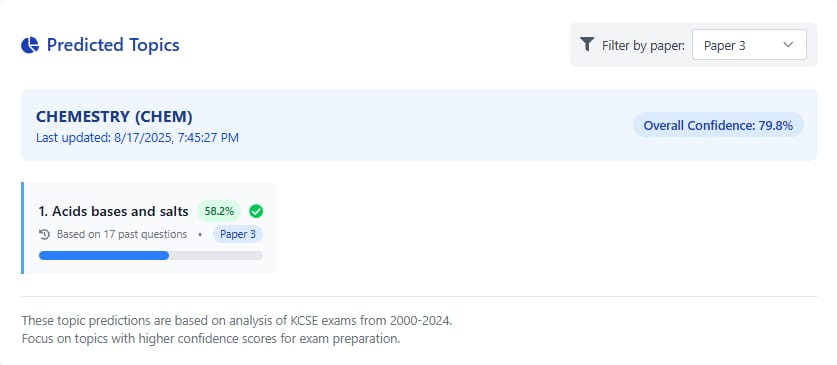
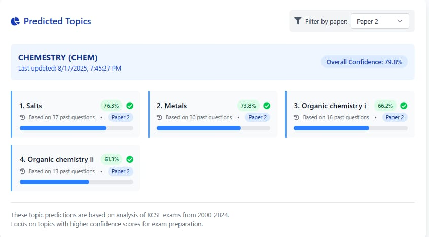
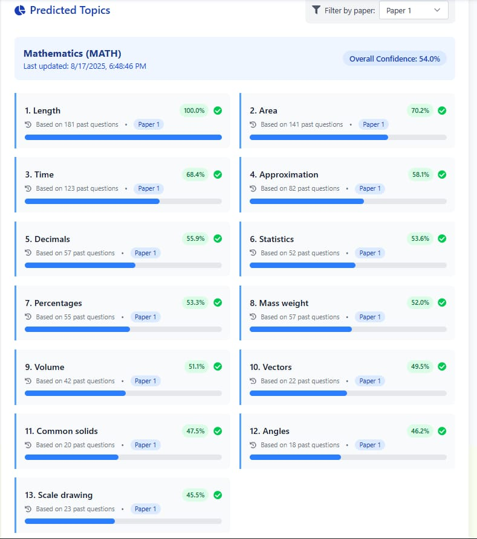
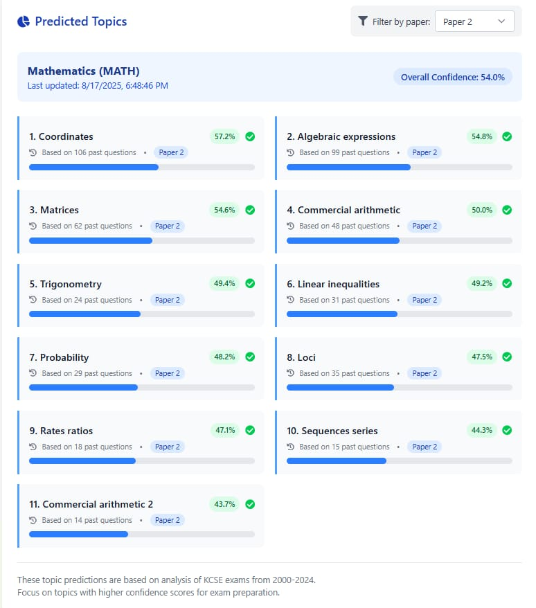
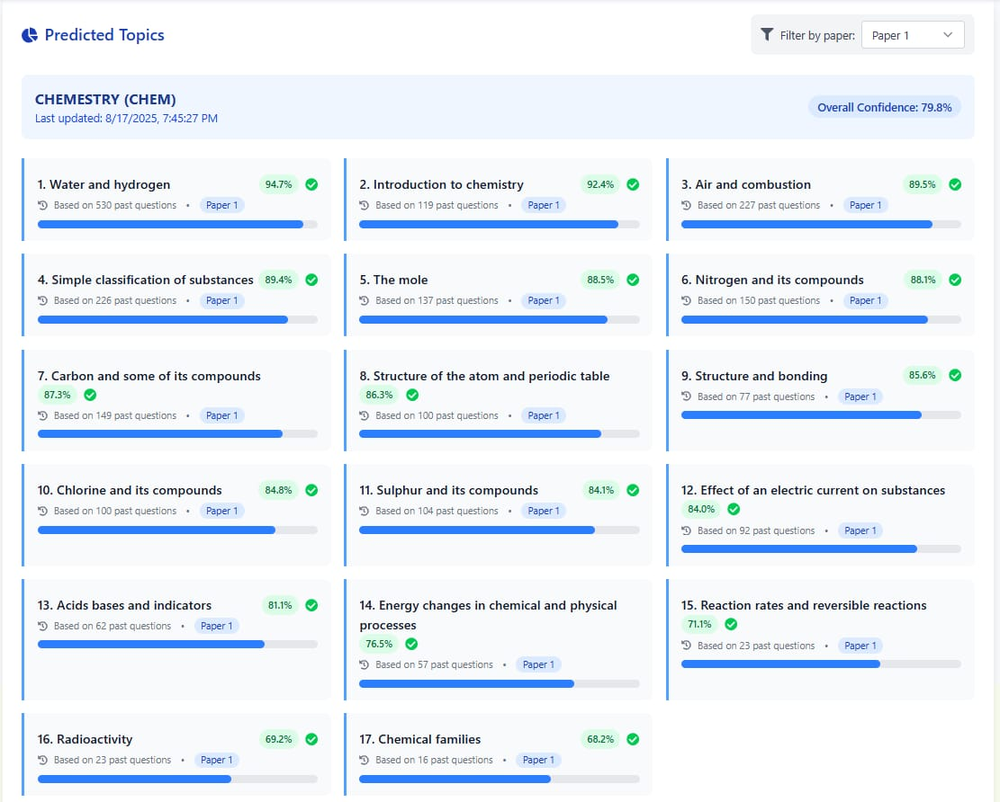

# KCSE Topic Predictor AI

## 📋 Overview
KCSE Topic Predictor AI analyzes 20+ years of KCSE past papers to predict likely exam topics. The system uses machine learning to identify patterns in question distribution across subjects.

## 🚀 Features
- **PDF Processing**: Extracts questions from past papers (2000-2024)
- **AI Predictions**: Machine learning model predicts topic probabilities
- **Subject Filtering**: Filter predictions by specific papers
- **Confidence Scores**: Visual indicators of prediction reliability

## 🛠️ Tech Stack
- **Backend**: Django, Django REST Framework
- **Frontend**: React, Tailwind CSS
- **ML**: scikit-learn, TF-IDF Vectorization
- **Database**: SQLite/PostgreSQL
- **PDF Processing**: pdfplumber, pytesseract

## 🖥️ Usage

### 🔍 View Predictions

<div align="center">









</div>


## ⚡ Quick Start

### 1. Backend Setup
```bash
cd backend
python -m venv venv
source venv/bin/activate  # Windows: venv\Scripts\activate
pip install -r requirements.txt
python manage.py migrate
python manage.py runserver
```
### 2. Frontend Setup
```bash
cd frontend
npm install
npm run dev
```
## Subject Support

- Mathematics (MATH)
- Chemistry (CHEM)
- Physics (PHYS)
- Biology (BIO)
- English (ENG)

## Subject Support

1. Extract: PDFs are processed to identify questions and topics
2. Analyze: Historical data is analyzed for topic frequency patterns
3. Predict: ML models predict topic probabilities for upcoming exams
4. Display: Results show confidence scores and paper distributions
